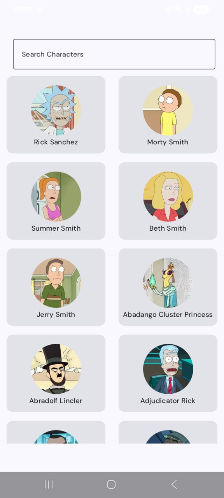
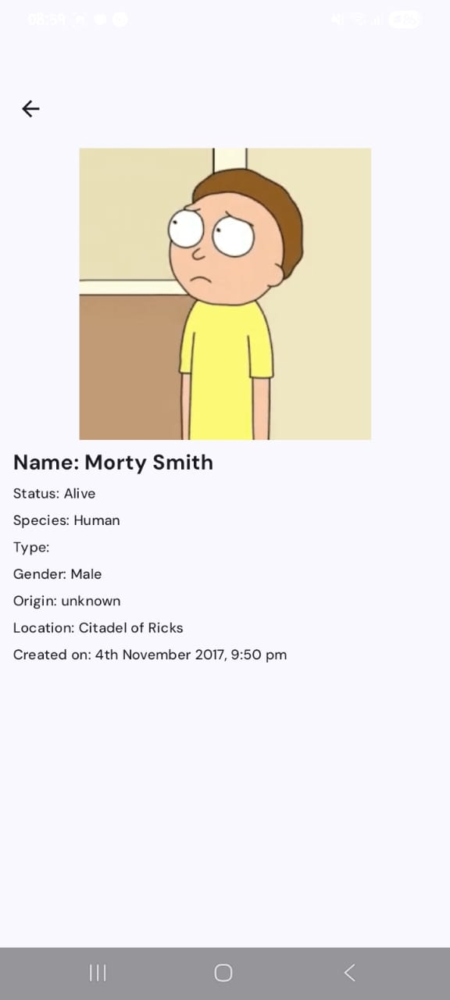
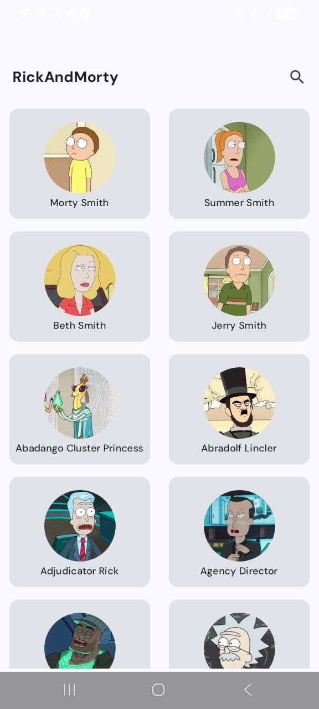
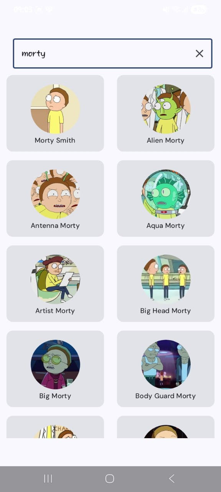

# RickAndMorty App 🛸


A simple Android application that allows users to search for **Rick and Morty** characters and view detailed information about each character. Designed with a clean UI and smooth user experience.

---

## ✨ Features

- 🔍 Search characters by name  
- 👤 View detailed character profiles  
- 📱 Modern, clean UI with Jetpack Compose  
- ⚡ Fast and responsive performance  

## 📸 Screenshots

<p align="center">
  
  
  
  
</p>

---


## 🛠 Tech Stack

- **Kotlin**
- **Jetpack Compose**
- **MVVM Architecture**
- **Retrofit**
- **Coroutines & Flow**

---

## 📦 API Used

This app uses the public **Rick and Morty API**:

- https://rickandmortyapi.com/

No API key is required.

---

## 🚀 Getting Started

1. Clone the repository:
   ```bash
   git clone https://github.com/morarafrank/RickAndMorty.git


2. Open the project in **Android Studio**

3. Sync Gradle and run the app on an emulator or device

---

## 🔐 Privacy Policy

### RickAndMorty App Privacy Policy

This app does **not collect, store, or share** any personal user data.

**Information Collection**

* No personal information is collected
* No user accounts or authentication

**Third-Party Services**

* Uses the **Rick and Morty API** for character data
* No ads, analytics, or tracking tools

**Children’s Privacy**

* This app does not knowingly collect data from children

**Policy Updates**

* Any updates to this policy will be reflected here

**Contact**
For questions, please reach out via the project repository.

---
## 📄 License
This project is licensed under the **Educational License** - see the [LICENSE](LICENSE) file for details.

